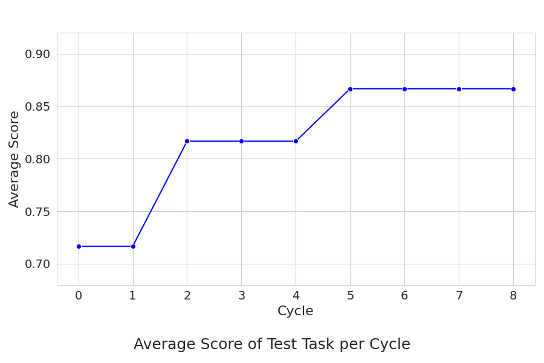

GEPAっぽいもの

Mastraを使った簡易的なデモです。プロンプトのマージは実装していません。

## 実験結果

Gemma 3 4Bモデルで8周実行したところ、確認用タスクの平均スコアが0.717 → 0.867に改善された。

<p align="center">
  
</p>

### 実験設定

- 使用モデル
  - タスク実行エージェント（`logicalThinkingAgent`）: Gemma 3 4B
  - タスク評価エージェント（`logicalEvaluationAgent`）: Gemini 2.5 Flash
  - プロンプト変異エージェント（`mutatePromptAgent`）: Gemini 2.5 Flash
- サイクル数（Budget）: 8回
  24回に設定したが途中でAPIエラーが発生したため、8回の試行で終了した。
- タスク
  - フィードバック用（`train`）: 8問 （id: 8, 13, 3, 10, 15, 17, 14, 20）
  - 確認用（`test`）: 12問 （id: 5, 9, 12, 18, 19, 16, 1, 7, 4, 11, 2, 6）

### プロンプト

**初期プロンプト**

```
与えられた問題を解いてください
```

確認用スコア: `[0.8, 0.6, 0.2, 1.0, 0.6, 1.0, 1.0, 0.2, 0.2, 1.0, 1.0, 1.0]`（平均: 0.717）

**最終プロンプト**

```
与えられた問題を解いてください。
問題を解く際は、以下の点に注意し、思考プロセスを段階的に示してください。

1.  問題文に記載されている全ての条件や制約を厳密に考慮し、矛盾がないように推論を進めてください。また、問題解決に必要となる一般的な知識や物理法則（例: 電球は点灯すると熱を持つなど）も適切に適用してください。
2.  特に、問題で定義されるルールや状態変化のメカニズム（例: スイッチの動作、日付の計算など）を正確に理解し、適用してください。方向転換（右、左）の指示は、現在の向きを基準とした相対的な変化として正確に解釈してください。
3.  全ての推論ステップを省略せず、論理の飛躍がないように詳細に記述してください。計算式や論理式も正確に表現してください。

最終的な答えだけでなく、その答えに至るまでの思考プロセスも明確に記述してください。思考プロセスの最終結果と最終的な答えが一致していることを確認してください。
```

確認用スコア: `[0.2, 1.0, 1.0, 1.0, 1.0, 1.0, 1.0, 1.0, 1.0, 0.8, 1.0, 0.4]`（平均: 0.867）

### タスク

<details>
  <summary>スコア改善例 （タスクid: 8）</summary>
  
**問題文**: 4月5日は金曜日でした。その月の第4日曜日は何日ですか？

**初期プロンプトでの回答**:

```
4月5日は金曜日なので、4月6日は土曜日、4月7日は日曜日、4月8日は月曜日、4月9日は火曜日、4月10日は水曜日、4月11日は木曜日、4月12日は金曜日、4月13日は土曜日、4月14日は日曜日です。

したがって、4月の第4日曜日は4月14日です。
```

スコア: `0.2`

フィードバック:

```
AIは4月5日が金曜日であることから、4月7日が日曜日であること（第1日曜日）を正しく特定できています。しかし、そこから第4日曜日を導き出す思考プロセスに重大な誤りがあります。AIは日付を順に数え上げていますが、その中で「第4日曜日」を特定するロジックが欠落しており、4月14日を第4日曜日と誤って結論付けています。4月14日は第2日曜日です。正しい思考プロセスとしては、第1日曜日（4月7日）から7日ごとに日付を加算していくことで、第2日曜日（4月14日）、第3日曜日（4月21日）、第4日曜日（4月28日）を求める必要があります。
```

**最終プロンプトでの回答**:

```
問題文に与えられた条件は以下のとおりです。
* 4月5日は金曜日です。

この条件を使って、4月中の第4日曜日の日付を求める必要があります。

1. **4月5日が金曜日であることから、4月6日は土曜日、4月7日は日曜日です。** これは、1週間（7日）の基本的な知識に基づいています。

2. **4月7日は4月の第1日曜日です。**

3. **4月の第2日曜日:** 4月7日 + 7日 = 4月14日

4. **4月の第3日曜日:** 4月14日 + 7日 = 4月21日

5. **4月の第4日曜日:** 4月21日 + 7日 = 4月28日

したがって、その月の第4日曜日は4月28日です。

最終的な答え：4月28日
```

スコア: `1.0`

フィードバック:

```
AIの解答は、問題の条件を正確に把握し、論理的かつ段階的に正しい答えを導き出しています。4月5日が金曜日であることから、4月7日が第1日曜日であることを特定し、そこから7日ごとに日付を加算して第4日曜日を算出するプロセスは模範解答の思考プロセスと完全に一致しており、非常に明確で正確です。最終的な答えも正しく、完璧な解答です。
```

</details>

<details>
  <summary>スコア低下例 （タスクid: 17）</summary>
  
**問題文**:
オンラインショップで買い物をします。商品の合計金額が5,000円未満の場合、送料が500円かかります。5,000円以上の場合、送料は無料です。もし、3,000円の商品と2,500円の商品を買った場合、支払う総額はいくらになりますか？

**初期プロンプトでの回答**:

```
3,000円の商品と2,500円の商品を合わせた合計金額は5,500円です。

5,000円以上の買い物なので、送料は無料です。

したがって、支払う総額は5,500円です。
```

スコア: `1.0`

フィードバック:

```
AIの解答は、問題文の条件を正確に理解し、論理的な思考プロセスを経て最終的な答えを導き出しています。

**良い点:**
*   商品の合計金額（3,000円 + 2,500円 = 5,500円）を正しく計算しています。
*   合計金額が5,000円以上の場合に送料が無料になるという条件を正確に適用し、送料が0円であることを適切に判断しています。
*   最終的な支払総額（5,500円 + 0円 = 5,500円）も正しく計算されています。

思考プロセス、最終的な答えともに完璧です。
```

**最終プロンプトでの回答**:

```
問題文の条件を整理します。

*   商品の合計金額が5,000円未満の場合、送料は500円
*   商品の合計金額が5,000円以上の場合は、送料は無料

購入する商品: 3,000円の商品と2,500円の商品

1.  **合計金額を計算する**:
    3,000円 + 2,500円 = 5,500円

2.  **送料の判定**:
    合計金額が5,500円であるため、5,000円以上なので、送料は無料です。

3.  **支払う総額を計算する**:
    商品の合計金額（5,500円）から送料（500円）を引きます。
    5,500円 - 500円 = 5,000円

**答え**: 支払う総額は5,000円です。
```

スコア: `1.0`

フィードバック:

```
AIは問題の条件整理と商品の合計金額の計算、そして送料が無料になるという判断までは正しく行っています。しかし、最終的な支払総額の計算において、直前のステップで「送料は無料」と正しく判断したにもかかわらず、誤って「500円」を送料として使用し、さらにそれを合計金額から「引いて」しまっています。これは思考プロセスにおける重大な矛盾と計算ミスです。

正しい計算は以下の通りです。
1. 商品の合計金額: 3,000円 + 2,500円 = 5,500円
2. 送料の判定: 合計金額が5,500円なので、5,000円以上となり送料は無料（0円）。
3. 支払う総額: 5,500円（商品代金） + 0円（送料） = 5,500円
```

</details>

---

タスク数もサイクル数も少ないので結構微妙。一応それっぽい結果になった。
